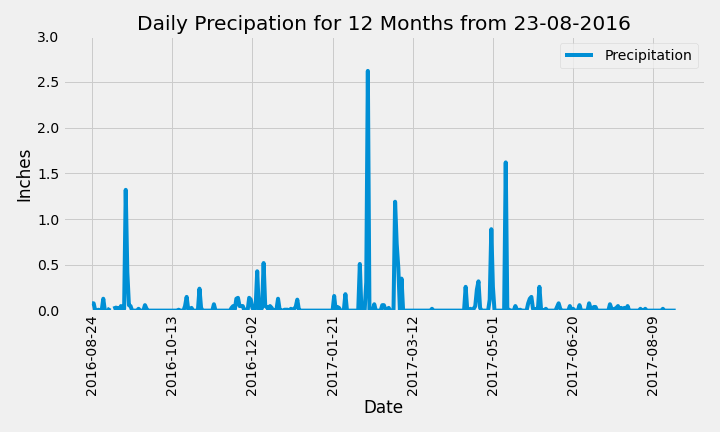
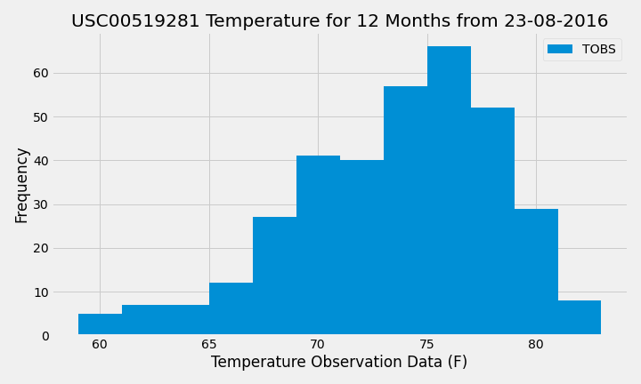

# sqlalchemy-challenge
 

### Background of the challenge
We were required to perform a climate analysis to help plan my vacation in Honolulu, Hawaii! 

1. Data analysis and data exploration using Python, SQL Alchemy, Pandas and Matplotlib
2. Design an app using Flask API

### Climate Analysis and Exploration

**1. Precipitation Analysis**

**2. Station Analysis**

There is a total of 9 weather stations in Honolulu, Hawaii. There most active station is USC00519281 at the Manoa Lyon Arboretum. Mental note to pack my rain poncho and waterproof boots if I'll be hiking there. :mosquito:

Temperature Observation Data for station USC00519281 | 
------------ | 
Lowest temperature recorded: 54.0 F | 
Highest temperature recorded: 85.0 F | 
Average temperature recorded: 71.7 F |

The average temperature seems lovely - but is that what I should be expecting? Let's check the temperature frequency histogram.

The mode in that area is approximately 76 F which is beautiful! From the shape, we can also determine that it is skewed to the right - a good direction to be leaning towards. :rainbow:

### Flask API - Climate App

Besides the homepage, the following 5 endpoints have also been created with Flask:

**/api/v1.0/precipitation**
- Format: JSON. Precipitation levels (in inches) by date for 12 months from 2016-08-23

**/api/v1.0/stations**
- Format: JSON. List of weather stations

**/api/v1.0/tobs**
- Format: JSON. List of temperature observations (TOBS) (in fahrenheit) for the most active station for 12 months from 2016-08-23

**/api/v1.0/&lt;start&gt;**
- Input start date in YYYY-MM-DD
- Format: JSON. List of minimum temperature, average temperature and maximum temperature from a given period

**/api/v1.0/&lt;start&gt;/&lt;end&gt;**
- Input start date and end date in YYYY-MM-DD
- Format: JSON. List of minimum temperature, average temperature and maximum temperature between the given start and end dates (inclusive)

### Files:

**1. Climate Analysis**
* Jupyter Notebook (filename: climate_analysis.ipynb)
   
**2. Flask API**
* Python (filename: app.py)
